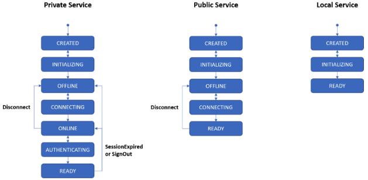

# Adding a New Service

A service is a Javascript class that contains public methods.  It can depend on other services through a built-in dependency injection framework, and can also be configured through the Maker config file / config options.

## Steps to add a new service

Here are the steps to add a new service called `ExampleService` to MakerJS:

1. In the `src` directory, create an `ExampleService.js` file in one of the subdirectories.  Also create a corresponding `ExampleService.spec.js` file in the `test` directory
2. In `src/config/DefaultServiceProvider.js`, import `ExampleService.js` and add it to the `_services` array
3. Create a class called `ExampleService` in `ExampleService.js`

```javascript
//example code in ExampleService.js for steps 3-6
import PublicService from '../core/PublicService';

export default class ExampleService extends PublicService {
	constructor (name='example') {
		super(name, ['log']);
	}

	test(){
		this.get('log').info('test');
	}
```

4. The service must `extend` one of:
	* `PrivateService` - requires both a network connection and authentication
	* `PublicService` - requires just a network connection
	* `LocalService` - requires neither

	See the `Service Lifecycle` section below for more info
5. In the constructor, call the parent class's constructor with the following arguments:
	1. The name of the service.  This is how the service can be referenced by other services
	2. An array of the names of services to depend on
6. Add the necessary public methods

```javascript
//example code in ExampleService.spec.js for step 7
import { buildTestService } from '../helpers/serviceBuilders';

//option 1: using buildTestService()
test('test the example service', async () => {
  const exampleService = buildTestService('example', {example: "ExampleService" });
  testService.test(); //logs "test"
});

//option 2: using the Maker object
test('test the example service', async () => {
  const customMaker = Maker.create('http', {example: "ExampleService"});
  const exampleService = customMaker.service('example');
  exampleService.test(); //console.logs "test"
});
```

7. Write a test in the test file.  You can either build a Maker object that uses your service, or use the `buildTestService` method found in `test/helpers/serviceBuilders` to only build the `ExampleSerivce`
8. (Optional) Implement the relevant service lifecycle functions (`initialize()`, `connect()`, and `authenticate()`).  See the `Service Lifecycle` section below for more info

```javascript
//example configuration for step 8
const maker = Maker.create('test', {
	example: {
	exampleSetting: true
	}
});
```
9. (Optional) Allow for configuration.  Service-specific settings can be passed into a service by the Maker config file or config options.  These service-specific settings can then be accessed from inside a service as the parameter passed into the `initialize` function (see the `Service Lifecycle` section below)

## Service Lifecycle
The three kinds of services mentioned in step 4 above follow the following state machine diagrams in the picture below.

```javascript
//example initialize() function in ExampleService.js
  initialize(settings) {
    this.get('log').info('ExampleService is initializing...');
    this._setSettings(settings);
  }
```

To specify what initializing, connecting and authenticating entails, implement the `initialize()`, `connect()`, and `authenticate()` functions in the service itself.  This will be called while the service's manager brings the service to the corresponding state.



```javascript
const exampleService = buildTestService('example', {example: "ExampleService" });

//wait for example service and its dependencies to initialize
await exampleService.manager().initialize();

//wait for example service and its dependencies to connect
await exampleService.manager().connect();

//wait for example service and its dependencies to authenticate
await exampleService.manager().authenticate();

//can also use callback syntax
exampleService.manager().onConnected(()=>{
	/*executed after connected*/
});

const maker = Maker.create('http', {example: "ExampleService"});

//wait for all services used by the maker object to authenticate
maker.authenticate();
```

A service will not finish initializing/connecting/authenticating until all of its dependent services have completed the same state (if applicable - for example a `LocalService` is considered authenticated/connected in addition to initialized, if it has finished initializing).  The example code here shows how to wait for the service to be in a certain state.

## Adding Custom Events

```javascript
//in PriceService.js
this.get('event').registerPollEvents({
      'price/ETH_USD': {
        price: () => this.getEthPrice()
      }
    });
```

One way to add an event is to “register” a function that gets called on each new block, using the event service's `registerPollEvents()` function.  For example, here is some code from the price service.
`this.getEthPrice()` will be called on each new block, and if the state has changed from the last call, a `price/ETH_USD` event will be emitted with the payload { price: [new_price] }.

```javascript
//in Web3Service.js
this.get('event').emit('web3/INITIALIZED', {
  provider: { ...settings.provider }
});
```

Another way to an add an event is to manually emit an event using ther event service's `emit` function.  For example, when the Web3Service initializes, it emits an event that contains info about the provider.

```javascript
//in the constructor in the Cdp.js
this._emitterInstance = this._cdpService.get('event').buildEmitter();
this.on = this._emitterInstance.on;
this._emitterInstance.registerPollEvents({
  COLLATERAL: {
    USD: () => this.getCollateralValueInUSD(),
    ETH: () => this.getCollateralValueInEth()
  },
  DEBT: {
    dai: () => this.getDebtValueInDai()
  }
});
```

Note that calling `registerPollEvents` and `emit()` directly on the event service like in the previous two examples will register events on the "default" event emitter instance.  However, you can create a new event emitter instance for your new service.  For example, the CDP object defines it's own event emitter, as can be seen here, by calling the event service's `buildEmitter()` function.
